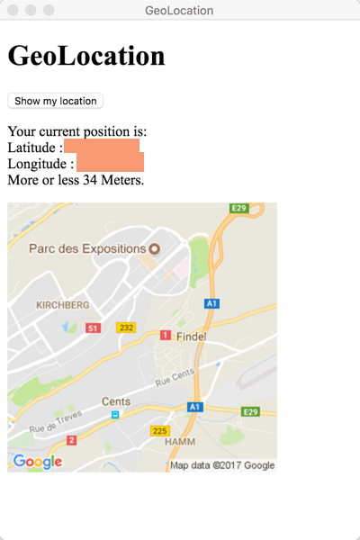
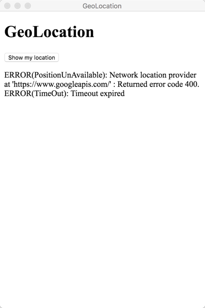
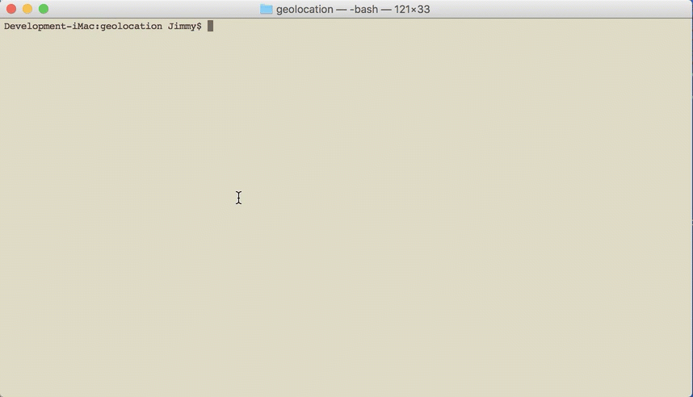

# Tutorial overview

This set of tutorials will be presented in muliple short parts.  

At this time WebSharp only includes a very lightweight DOM Interface `[place link here to DOM overview]`.  That does not mean that you can not access other HTML or HTML 5 functionality.  In this series of multiple short tutorials we will show how you can tap into the other functionality using `ScriptObject`'s and modeling those other API interfaces.  By wrapping the HTML functionality in higher-level custom classes we can create a strongly typed interface to build a custom library.

`Part 1` - The document you are reading now, will focus on quickly generating the application and creating the structure of the application for scripting the `navigator.geolocation` functionality.  Adding code to interface with the DOM Html Elements and handling the button `click` event.  Since the focus of this set of tutorials is the scripting interface, the application interface itself will be very minimal.

[Part 2](./part2) - Adding a new source module to the project that contains the scripting for `navigator.geolocation` using the documentation from the [Geolocation API Specification](https://dev.w3.org/geo/api/spec-source.html#navi-geo).  We will then focus on incorporating that new source module in our application. 

[Part 3](./part3) - By default when creating a `WebSharp Electron Application`, on-the-fly compiling is used so we will cover compiling these modules into actual assemblies.  [Getting Started Building Websharp Electron Application Assemblies](https://github.com/xamarin/WebSharp/blob/master/docs/getting-started/getting-started-websharp-building-assemblies.md).

[Part 4](./part4) - Packaging our application using `electron-packager` so that we have an actual application to execute.


## End Goal

At the end of the series we will have created a simple application with a button that will call out to a strongly typed C# `navigation.geolocation` api to retrieve the current location and display a map image of that position.



If there are errors accessing the api then we will display them as well.



## Prerequisites

1. You need [node.js](https://nodejs.org/en/) installed and available in your $PATH.

   * `electron-dotnet` needs to be built.  The easiest way is to use the provided `make` files available in the WebSharp base directory.  
   
      * [See Getting Started on Windows](https://github.com/xamarin/WebSharp/blob/master/docs/getting-started/getting-started-dev-windows.md)
   
      * [See Getting Started on Mac](https://github.com/xamarin/WebSharp/blob/master/docs/getting-started/getting-started-dev-mac.md)

1. Optional icons used for your application.  These will be used when packaging the application later in the tutorial.  If not provided then the `Electron` default icons will be used.  See [Setting Application Icon - Mac and Windows](https://github.com/xamarin/WebSharp/tree/master/docs/tutorials/appicon#setting-application-icon---mac-and-windows)

1. To begin using the `navigator.geolocation` api provided by Google you will need to have an API Key.

### API keys

API keys are
freely available with a Google Account at https://developers.google.com/console.
To generate a server key for your project:

 1. Visit https://developers.google.com/console and log in with
    a Google Account.
 1. Select an existing project, or create a new project.
 1. Click **Enable an API**.
 1. Browse for `Geocoding API`, and set its status to "On". Other services are also available:
    * Directions API
    * Distance Matrix API
    * Elevation API
    * Time Zone API
    * Roads API
    * Street View Image API
 1. Once you've enabled the APIs, click **Credentials** from the left navigation of the Developer
    Console.
 1. In the "Public API access", click **Create new Key**.
 1. Choose **Server Key**.
 1. If you'd like to restrict requests to a specific IP address, do so now.
 1. Click **Create**.

Your API key should be 40 characters long, and begin with `AIza`.

**Important:** This key should be kept secret on your server.

## Creating the application

The first task is generating the application code so we can get started.  By following the [Create a new `WebSharp Electron Application`](https://github.com/xamarin/WebSharp/blob/master/docs/getting-started/getting-started-websharp-electron-application.md#generate-a-websharp-electron-application) getting started document we can quickly set up an application and get started.


After you have the application generated you will need to open the project up into your favorite text editor.


## index.html

The first thing we will want to do is setup `index.html` file to create the elements that we will be interacting with.

```javascript

<!DOCTYPE html>
<html>
  <head>
    <meta charset="UTF-8">
    <title>GeoLocation</title>
  </head>
  <body>
    <h1>GeoLocation</h1>
    <p><button id="findMe">Show my location</button></p>
    <p id="location"></p>
    <div id="out">
      </img>
    </div>
  </body>

  <script>
    // You can also require other files to run in this process
    require('./renderer.js')
  </script>
</html>

```

* This will create a button with the `id` of `findMe`:

```javascript
<p><button id="findMe">Show my location</button></p>
```

* An output area with the `id` of `location` that will display the location longitude and latitude on successful call to the geolocation api or the error(s) returned if the api was not able to complete successfully.

```javascript
<p id="location"></p>
```

* Our image area used to display the map image returned back from the geolocation api on succesful call.

## Renderer process `Location.cs`

For right now let's set up the application to interact with our DOM elements defined in the `index.html` definition above.  This will only be preparation until we have the API defined in Part 2.  You can find out more about interacting the DOM by reading the [DOM Overview](https://github.com/xamarin/WebSharp/blob/master/docs/tutorials/DOM/overview.md).

> :bulb: The `navigation.geolocation` can only be referenced in the `Renderer` process.  If you try referencing from the Main process you will get an error about the `navigation` object not being defined.  For that reason we will be focusing all of our attention in this module.

Open the `Location.cs` source file and let's add the following code.

```cs

    try
    {

        var document = await HtmlPage.GetDocument();
        var findMe = await document.GetElementById("findMe");
        var map = await document.GetElementById("map");
        var location = await document.GetElementById("location");

        // Click event listener code goes here

    }

```

### Html Element references

Obtain a reference to the `findMe` HtmlElement that represents a button tag `<button>`.

```cs
var findMe = await document.GetElementById("findMe");
```

Obtain a reference to the `map` HtmlElement that represents an image tag `<image>`.

```cs
var map = await document.GetElementById("map");
```

Obtain a reference to the `location` HtmlElement that represents a paragraph tag `<p>` that we will be using as our status area.

```cs
var location = await document.GetElementById("map");
```

### Button click event listener

When the `findMe` button is clicked is where the geolocation api will be called. To do this we will need to listen to the button's `click` event.

```cs

    await findMe.AttachEvent("click",
        new EventHandler(
            async (sender, evt) => {

                await location.SetProperty("innerText", "Locating ...");

            }
        )
    );

```

When we get a `click` from the button we will set our status area to `Locating...` by setting the `innerText` property of our HtmlElement `findeMe`.

```cs
    await location.SetProperty("innerText", "Locating ...");

```

Now if the application is run you will see the following:



## Summary

In this tutorial we went through creating a application and modifying the source to reference the DOM elements that will be needed in the next parts when we start implementing the GeoLocation interface.

We also saw how to interfact with DOM events by listening to the `click` event of the button tag `<button>`.

In the next part, [Part 2](./part2), of the tutorial we will start the `Scripting` of the `navigation.geolocation` HTML interface.

For more information see the following:

1. Getting started documents

    * [See Getting Started on Windows](https://github.com/xamarin/WebSharp/blob/master/docs/getting-started/getting-started-dev-windows.md)
   
    * [See Getting Started on Mac](https://github.com/xamarin/WebSharp/blob/master/docs/getting-started/getting-started-dev-mac.md)

1. [Create a new `WebSharp Electron Application`](https://github.com/xamarin/WebSharp/blob/master/docs/getting-started/getting-started-websharp-electron-application.md#generate-a-websharp-electron-application)

1. [DOM Overview](https://github.com/xamarin/WebSharp/blob/master/docs/tutorials/DOM/overview.md)

1. [Google API Keys](https://developers.google.com/console)